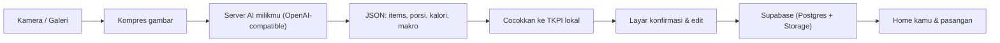

# 🥗 diet-yuk — Rencana Aplikasi (v0.2)

> Aplikasi iOS pribadi buat penghitung kalori untuk 2 orang (kamu & pasangan), dengan UI minimalis + lucu bertema couple, dan countdown ke hari pernikahan 💍 **26 September 2027**.

---

## 1. Keputusan yang Sudah Disepakati

> 📋 Detail teknis eksekusi: [docs/IMPLEMENTATION_PLAN.md](docs/IMPLEMENTATION_PLAN.md)

| Topik | Keputusan |
|---|---|
| Pengguna | **Raka** & **Anggun** |
| Platform | iOS, **React Native + Expo + TypeScript** |
| Supabase | Project sudah ada → tinggal connect via `.env` + `supabase link` |
| AI Vision | Lewat **server/proxy milikmu sendiri** (mis. Hermes) yang memakai langganan ChatGPT Pro. App cukup memanggil endpoint yang bisa diatur di Settings |
| Instalasi | **Apple ID gratis + Xcode** (pasang ulang tiap 7 hari) |
| Sync | **Supabase** (free tier) — bisa lihat progres pasangan |
| Mac + Xcode | ✅ Ada |
| Fitur tambahan MVP | Log berat badan + grafik, pengingat waktu makan, streak & pencapaian |
| Tema | **Couple / pernikahan** — 2 karakter maskot |

---

## 2. Tech Stack

| Lapisan | Pilihan |
|---|---|
| Framework | Expo (SDK terbaru, *development build* — bukan Expo Go) + TypeScript |
| Navigasi | Expo Router |
| Styling | NativeWind (Tailwind) + design tokens pastel |
| Animasi | Reanimated + Lottie / SVG untuk maskot |
| State | Zustand + TanStack Query |
| Kamera | expo-camera / expo-image-picker + expo-image-manipulator (kompres) |
| Notifikasi | expo-notifications (**local notification** — aman di Apple ID gratis) |
| Grafik | victory-native / react-native-gifted-charts |
| Backend | Supabase: Auth (email + password), Postgres, Storage (foto makanan), RLS |
| Data nutrisi | Dataset **TKPI** (Kemenkes) dibundel sebagai JSON + estimasi AI |
| Secret | expo-secure-store (URL + token server AI) |

---

## 3. Integrasi AI (Server Milikmu)

App **tidak** mengikat ke satu provider. Di Settings ada:
- `AI Base URL` (mis. `https://ai.domainmu.com`)
- `AI Token` (bearer token buat proteksi server)

### Kontrak API yang disarankan (server kamu yang implement)
Supaya fleksibel, pakai format **OpenAI-compatible** (`POST /v1/chat/completions` dengan image `base64`) — jadi Hermes / LiteLLM / proxy apa pun yang OpenAI-compatible langsung bisa dipakai. App yang menyusun prompt & meminta output JSON:

```json
{
  "items": [
    {
      "name": "Nasi putih",
      "tkpi_match": "Nasi",
      "portion_g": 150,
      "calories": 195,
      "protein_g": 3.6,
      "carbs_g": 43,
      "fat_g": 0.3,
      "confidence": 0.86
    }
  ],
  "notes": "Porsi diperkirakan dari ukuran piring standar"
}
```

Alur: hasil AI → dicocokkan ke TKPI lokal (kalau ada match, angka kalori pakai TKPI × gram) → user konfirmasi/edit → simpan.

Selama server kamu belum siap, app punya **mode mock** (hasil dummy) supaya UI tetap bisa dikembangkan & dites.

> [!WARNING]
> Memakai langganan ChatGPT (bukan OpenAI API resmi) lewat proxy pihak ketiga bisa melanggar ToS OpenAI dan berisiko akun kena limit/blokir. Karena endpoint-nya bisa diganti, kapan pun bisa pindah ke OpenAI API / Gemini tanpa ubah app.

---

## 4. Instalasi dengan Apple ID Gratis

Hal yang perlu diketahui:
- App **expired tiap 7 hari** → colok iPhone ke Mac, jalankan ulang build dari Xcode (data tetap aman karena tersimpan di Supabase + lokal).
- iPhone pasangan juga harus didaftarkan: colok ke Mac kamu sekali, aktifkan **Developer Mode** di iPhone-nya, lalu *trust* developer di Settings → General → VPN & Device Management.
- Batasan Apple ID gratis: maks 3 app sideload per device, **tidak ada push notification remote** (local notification tetap bisa → cukup untuk pengingat makan), tidak ada Sign in with Apple.
- Akan disediakan script `npm run ios:device` + panduan langkah demi langkah di `docs/INSTALL.md`.

---

## 5. Fitur MVP

### 🏠 Home / Hari Ini
- Kartu **Countdown 💍** "XXX hari lagi menuju 26.09.2027" + 2 maskot couple
- Ring progres kalori (terpakai / target) + bar makro (P/K/L)
- Daftar makan hari ini: Sarapan, Makan Siang, Makan Malam, Camilan
- Kartu mini **progres pasangan** hari ini
- Tombol besar 📸 **"Foto Makanan"**

### 📸 Tambah Makanan
1. Ambil foto / pilih dari galeri → kompres
2. Kirim ke server AI → tampilkan item terdeteksi
3. Edit porsi (gram / slider), ganti item dari TKPI, tambah/hapus item
4. Simpan ke kategori makan (foto disimpan di Supabase Storage)
- Alternatif: cari manual dari TKPI + "makanan favorit" & "baru saja dimakan"

### 📊 Progres
- Grafik kalori mingguan / bulanan
- **Log berat badan** + grafik tren menuju target
- **Streak 🔥** (hari berturut-turut mencatat & sesuai target) + **pencapaian/badge** (mis. "7 hari konsisten", "-3 kg", "100 hari menuju nikah")

### 🔔 Pengingat
- Notifikasi lokal jam makan (bisa diatur per orang), pengingat timbang berat mingguan

### 👤 Profil & Settings
- Onboarding: nama, jenis kelamin, umur, tinggi, berat, target berat, level aktivitas
- Target kalori otomatis (Mifflin-St Jeor + defisit aman), bisa di-override manual
- Pairing dengan pasangan (kode undangan)
- Settings: AI Base URL & token, tanggal nikah, jam pengingat

---

## 6. Konsep UI

- **Palet pastel**: blush pink, peach, mint, krem; sudut membulat besar; font bulat (*Nunito* / *Quicksand*).
- **Dua maskot couple** (versi kamu & pasangan, mis. dua karakter chibi pakai baju pengantin kecil) yang:
  - berubah ekspresi sesuai progres kalori (senang / kenyang / lapar)
  - makin dekat hari nikah → animasi kecil (bunga, cincin, dsb.)
- Micro-animation saat simpan makanan, confetti saat streak/pencapaian baru.

---

## 7. Model Data (Supabase)

```mermaid
erDiagram
  profiles ||--o{ meals : has
  profiles ||--o{ weight_logs : has
  profiles ||--o{ achievements : earns
  couples ||--|{ profiles : contains
  meals ||--|{ meal_items : contains

  profiles { uuid id; text name; text sex; date birth_date; int height_cm; numeric target_weight; text activity; int daily_kcal_target; uuid couple_id }
  couples { uuid id; date wedding_date; text invite_code }
  meals { uuid id; uuid user_id; date eaten_on; text meal_type; text photo_url }
  meal_items { uuid id; uuid meal_id; text name; numeric grams; numeric kcal; numeric protein; numeric carbs; numeric fat; text source }
  weight_logs { uuid id; uuid user_id; date logged_on; numeric weight_kg }
  achievements { uuid id; uuid user_id; text code; timestamptz earned_at }
```

RLS: user hanya bisa tulis datanya sendiri, dan bisa **baca** data pasangan dalam `couple_id` yang sama.

---

## 8. Arsitektur



---

## 9. Tahapan Pengerjaan

1. **Setup** — Expo + TS + Expo Router + NativeWind + font + design tokens
2. **Supabase** — skema, RLS, auth, pairing pasangan
3. **Onboarding & profil** — kalkulasi target kalori
4. **Home** — countdown nikah, ring kalori, daftar makan, progres pasangan
5. **TKPI dataset** + pencarian manual
6. **Foto + AI** (dengan mode mock) + layar edit hasil
7. **Progres** — grafik kalori, log berat, streak & pencapaian
8. **Pengingat** — local notifications
9. **Polish UI** — maskot couple, animasi, app icon, splash
10. **Build ke device** + `docs/INSTALL.md`

---

## 10. Hal yang Masih Perlu Dari Kamu (nanti, bukan blocker)

- Akun/project **Supabase** (URL + anon key) — bisa aku bantu langkahnya.
- URL + token **server AI** kamu saat sudah siap (sebelum itu pakai mode mock).
- Nama panggilan kamu & pasangan (untuk maskot/teks).
